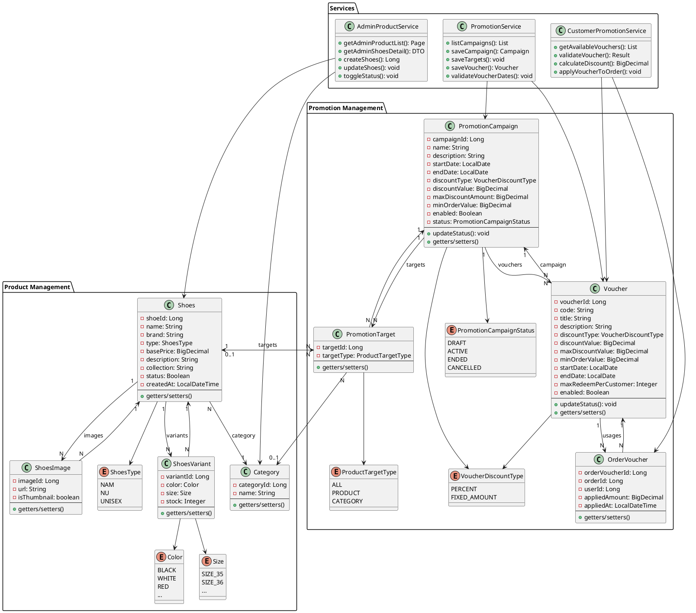

# Class Diagram - Quản lý Sản phẩm, Khuyến mãi, Customer Voucher

## 📌 TỔNG QUAN

Class Diagram được thiết kế dựa trên:
- ✅ **Code thực tế** (Java Spring Boot + JPA/Hibernate)
- ✅ **Đặc tả Use Case** (UC23, UC24, UC25, UC26)
- ✅ **Database schema** (PostgreSQL)

---

## 🎯 MODULE 1: QUẢN LÝ SẢN PHẨM (Product Management)

### **1. Class: Shoes (Entity)**
```java
@Entity
@Table(name = "shoes")
class Shoes {
    // Primary Key
    - shoeId: Long @Id @GeneratedValue
    
    // Attributes
    - name: String @NotBlank
    - brand: String @NotBlank
    - type: ShoesType @Enumerated (NAM, NU, UNISEX)
    - basePrice: BigDecimal @Positive
    - description: String @Column(TEXT)
    - collection: String
    - status: Boolean (true = Đang bán, false = Ngừng bán)
    - createdAt: LocalDateTime @CreationTimestamp
    
    // Relationships
    - category: Category @ManyToOne @JoinColumn(categoryId)
    - images: List<ShoesImage> @OneToMany(mappedBy="shoes", cascade=ALL, orphanRemoval=true)
    - variants: Set<ShoesVariant> @OneToMany(mappedBy="shoes", cascade=ALL, orphanRemoval=true)
    - promotionTargets: List<PromotionTarget> @OneToMany(mappedBy="shoe")
    
    // Methods
    + Shoes() // Constructor
    + getters/setters
}
```

**Quan hệ:**
- `Shoes` **N:1** `Category` (Many shoes belong to one category)
- `Shoes` **1:N** `ShoesImage` (One shoe has many images)
- `Shoes` **1:N** `ShoesVariant` (One shoe has many variants)
- `Shoes` **1:N** `PromotionTarget` (One shoe can be in many promotion targets)

---

### **2. Class: Category (Entity)**
```java
@Entity
@Table(name = "category")
class Category {
    // Primary Key
    - categoryId: Long @Id @GeneratedValue
    
    // Attributes
    - name: String @NotBlank @Unique
    
    // Relationships
    - shoes: List<Shoes> @OneToMany(mappedBy="category")
    - promotionTargets: List<PromotionTarget> @OneToMany(mappedBy="category")
    
    // Methods
    + Category() // Constructor
    + getters/setters
}
```

**Quan hệ:**
- `Category` **1:N** `Shoes` (One category has many shoes)
- `Category` **1:N** `PromotionTarget` (One category can be in many promotion targets)

---

### **3. Class: ShoesImage (Entity)**
```java
@Entity
@Table(name = "shoes_image")
class ShoesImage {
    // Primary Key
    - imageId: Long @Id @GeneratedValue
    
    // Attributes
    - url: String @NotBlank (Cloudinary URL hoặc public URL)
    - isThumbnail: boolean (true = ảnh đại diện)
    
    // Relationships
    - shoes: Shoes @ManyToOne @JoinColumn(shoeId)
    
    // Methods
    + ShoesImage() // Constructor
    + getters/setters
}
```

**Quan hệ:**
- `ShoesImage` **N:1** `Shoes` (Many images belong to one shoe)

---

### **4. Class: ShoesVariant (Entity)**
```java
@Entity
@Table(name = "shoes_variant", uniqueConstraints = {
    @UniqueConstraint(columnNames = {"shoe_id", "color", "size"})
})
class ShoesVariant {
    // Primary Key
    - variantId: Long @Id @GeneratedValue
    
    // Attributes
    - color: Color @Enumerated (BLACK, WHITE, RED, BLUE, ...)
    - size: Size @Enumerated (SIZE_38, SIZE_39, SIZE_40, ...)
    - stock: Integer (số lượng tồn kho - optional, chưa dùng)
    
    // Relationships
    - shoes: Shoes @ManyToOne @JoinColumn(shoeId)
    
    // Methods
    + ShoesVariant() // Constructor
    + getters/setters
}
```

**Quan hệ:**
- `ShoesVariant` **N:1** `Shoes` (Many variants belong to one shoe)

**Constraint:**
- Unique (shoe_id, color, size) - Không trùng biến thể

---

### **5. Class: ShoesType (Enum)**
```java
enum ShoesType {
    NAM,      // Giày nam
    NU,       // Giày nữ
    UNISEX    // Giày unisex
}
```

---

### **6. Class: Color (Enum)**
```java
enum Color {
    BLACK, WHITE, RED, BLUE, GREEN, YELLOW, 
    ORANGE, PINK, PURPLE, BROWN, GRAY, ...
}
```

---

### **7. Class: Size (Enum)**
```java
enum Size {
    SIZE_35("35"), SIZE_36("36"), SIZE_37("37"),
    SIZE_38("38"), SIZE_39("39"), SIZE_40("40"),
    SIZE_41("41"), SIZE_42("42"), SIZE_43("43"),
    SIZE_44("44"), SIZE_45("45"), ...;
    
    - value: String
    
    + Size(String value)
    + getValue(): String
}
```

---

### **8. Class: AdminProductController (Controller)**
```java
@Controller
@RequestMapping("/admin/products")
class AdminProductController {
    // Dependencies
    - adminProductService: AdminProductService @Autowired
    - categoryRepository: CategoryRepository @Autowired
    
    // Methods (Endpoints)
    + listProducts(page, size, keyword, categoryId, brand, status, model): String @GetMapping
    + showCreateForm(model): String @GetMapping("/create")
    + createProduct(request, bindingResult, model, redirectAttributes): String @PostMapping("/create")
    + showEditForm(id, model, redirectAttributes): String @GetMapping("/{id}/edit")
    + updateProduct(id, request, bindingResult, model, redirectAttributes): String @PostMapping("/{id}/edit")
    + toggleProductStatus(id, redirectAttributes): String @PostMapping("/{id}/toggle-status")
    + viewProductDetail(id, model, redirectAttributes): String @GetMapping("/{id}")
}
```

**Mô tả:**
- Handle HTTP requests từ admin
- Gọi service để xử lý business logic
- Return view name (Thymeleaf template)

---

### **9. Class: AdminProductService (Service)**
```java
@Service
@Transactional
class AdminProductService {
    // Dependencies
    - adminShoesRepository: AdminShoesRepository @Autowired
    - categoryRepository: CategoryRepository @Autowired
    
    // Methods (Business Logic)
    + getAdminProductList(page, size, keyword, categoryId, brand, status): Page<AdminShoesListItemDto> @Transactional(readOnly=true)
    + getAdminShoesDetail(shoeId): AdminShoesDetailDto @Transactional(readOnly=true)
    + createShoes(request): Long @Transactional
    + updateShoes(shoeId, request): void @Transactional
    + toggleStatus(shoeId): void @Transactional
    + changeProductStatus(shoeId, status): void @Transactional
    - normalizeSize(raw): String (private helper)
}
```

**Business Logic:**
- Validate input
- Normalize size (VD: "42" → "SIZE_42")
- Check duplicate variants (color + size)
- Handle orphan removal for images/variants
- Log actions

---

### **10. Class: AdminShoesRepository (Repository)**
```java
@Repository
interface AdminShoesRepository extends JpaRepository<Shoes, Long> {
    // Custom queries
    + searchProducts(keyword, categoryId, brand, status, pageable): Page<Shoes> @Query
    + findByIdWithAllDetails(shoeId): Optional<Shoes> @Query (eager fetch category, images, variants)
    + existsByName(name): boolean
    + existsByNameAndShoeIdNot(name, shoeId): boolean
}
```

**Mô tả:**
- Data access layer
- JPQL queries với filter động
- Eager fetch để tránh N+1 problem

---

### **11. DTOs (Data Transfer Objects)**

#### **AdminShoesListItemDto** (cho danh sách)
```java
class AdminShoesListItemDto {
    - shoeId: Long
    - name: String
    - brand: String
    - categoryName: String
    - basePrice: BigDecimal
    - status: Boolean
}
```

#### **AdminShoesDetailDto** (cho chi tiết)
```java
class AdminShoesDetailDto {
    - shoeId: Long
    - name: String
    - brand: String
    - type: ShoesType
    - basePrice: BigDecimal
    - description: String
    - collection: String
    - categoryId: Long
    - categoryName: String
    - status: Boolean
    - images: List<ImageDto>
    - variants: List<VariantDto>
    
    static class ImageDto {
        - imageId: Long
        - url: String
        - isThumbnail: boolean
    }
    
    static class VariantDto {
        - variantId: Long
        - color: String
        - size: String
    }
}
```

#### **CreateShoesRequest** (cho tạo mới)
```java
class CreateShoesRequest {
    - name: String @NotBlank
    - brand: String @NotBlank
    - type: ShoesType @NotNull
    - basePrice: BigDecimal @Positive
    - description: String
    - collection: String
    - categoryId: Long @NotNull
    - images: List<ImageDto>
    - variants: List<VariantDto>
    
    static class ImageDto {
        - url: String
        - isThumbnail: boolean
    }
    
    static class VariantDto {
        - color: String
        - size: String
    }
}
```

#### **UpdateShoesRequest** (cho cập nhật)
```java
class UpdateShoesRequest {
    // Giống CreateShoesRequest + imageId, variantId cho update
    - name: String @NotBlank
    - brand: String @NotBlank
    - type: ShoesType @NotNull
    - basePrice: BigDecimal @Positive
    - description: String
    - collection: String
    - categoryId: Long @NotNull
    - images: List<ImageDto>
    - variants: List<VariantDto>
    
    static class ImageDto {
        - imageId: Long (null nếu ảnh mới)
        - url: String
        - isThumbnail: boolean
    }
    
    static class VariantDto {
        - variantId: Long (null nếu variant mới)
        - color: String
        - size: String
    }
}
```

---

## 🎯 MODULE 2: QUẢN LÝ KHUYẾN MÃI (Promotion Management)

### **1. Class: PromotionCampaign (Entity)**
```java
@Entity
@Table(name = "promotion_campaign")
class PromotionCampaign {
    // Primary Key
    - campaignId: Long @Id @GeneratedValue
    
    // Attributes
    - name: String @NotBlank
    - description: String @Column(TEXT)
    - startDate: LocalDate @NotNull
    - endDate: LocalDate @NotNull
    - discountType: VoucherDiscountType @Enumerated (PERCENT, FIXED_AMOUNT)
    - discountValue: BigDecimal @Positive
    - maxDiscountAmount: BigDecimal (null = không giới hạn)
    - minOrderValue: BigDecimal (null = không yêu cầu)
    - enabled: Boolean (true = Bật, false = Tắt)
    - status: PromotionCampaignStatus @Enumerated (DRAFT, ACTIVE, ENDED, CANCELLED)
    
    // Relationships
    - targets: List<PromotionTarget> @OneToMany(mappedBy="campaign", cascade=ALL, orphanRemoval=true, fetch=EAGER)
    - vouchers: List<Voucher> @OneToMany(mappedBy="campaign")
    
    // Methods
    + PromotionCampaign() // Constructor
    + updateStatus(): void @PrePersist @PreUpdate (tự động tính status dựa trên enabled + dates)
    + getters/setters
}
```

**Quan hệ:**
- `PromotionCampaign` **1:N** `PromotionTarget` (One campaign has many targets)
- `PromotionCampaign` **1:N** `Voucher` (One campaign has many vouchers)

**Logic tính Status:**
```
IF enabled == false THEN status = CANCELLED
ELSE IF today < startDate THEN status = DRAFT
ELSE IF today > endDate THEN status = ENDED
ELSE status = ACTIVE
```

---

### **2. Class: PromotionTarget (Entity)**
```java
@Entity
@Table(name = "promotion_target")
class PromotionTarget {
    // Primary Key
    - targetId: Long @Id @GeneratedValue
    
    // Attributes
    - targetType: ProductTargetType @Enumerated (ALL, PRODUCT, CATEGORY)
    
    // Relationships
    - campaign: PromotionCampaign @ManyToOne @JoinColumn(campaignId)
    - shoe: Shoes @ManyToOne @JoinColumn(shoeId, nullable=true)
    - category: Category @ManyToOne @JoinColumn(categoryId, nullable=true)
    
    // Methods
    + PromotionTarget() // Constructor
    + getters/setters
}
```

**Quan hệ:**
- `PromotionTarget` **N:1** `PromotionCampaign` (Many targets belong to one campaign)
- `PromotionTarget` **N:1** `Shoes` (Many targets can point to one shoe)
- `PromotionTarget` **N:1** `Category` (Many targets can point to one category)

**Business Rule:**
- Nếu `targetType = ALL`: `shoe = null`, `category = null`
- Nếu `targetType = PRODUCT`: `shoe != null`, `category = null`
- Nếu `targetType = CATEGORY`: `shoe = null`, `category != null`

---

### **3. Class: Voucher (Entity)**
```java
@Entity
@Table(name = "voucher")
class Voucher {
    // Primary Key
    - voucherId: Long @Id @GeneratedValue
    
    // Attributes
    - code: String @NotBlank @Unique (mã voucher, VD: "GIAM50K")
    - title: String (tiêu đề, VD: "Giảm 50K cho đơn từ 500K")
    - description: String @Column(TEXT)
    - discountType: VoucherDiscountType @Enumerated (PERCENT, FIXED_AMOUNT)
    - discountValue: BigDecimal @Positive
    - maxDiscountValue: BigDecimal (fallback từ campaign hoặc 0)
    - minOrderValue: BigDecimal (fallback từ campaign hoặc 0)
    - startDate: LocalDate @NotNull (phải >= campaign.startDate)
    - endDate: LocalDate @NotNull (phải <= campaign.endDate)
    - maxRedeemPerCustomer: Integer (null = không giới hạn)
    - enabled: Boolean (true = Bật, false = Tắt)
    
    // Relationships
    - campaign: PromotionCampaign @ManyToOne @JoinColumn(campaignId) @NotNull
    - orderVouchers: List<OrderVoucher> @OneToMany(mappedBy="voucher")
    
    // Methods
    + Voucher() // Constructor
    + updateStatus(): void (tính status dựa trên enabled + dates)
    + getters/setters
}
```

**Quan hệ:**
- `Voucher` **N:1** `PromotionCampaign` (Many vouchers belong to one campaign)
- `Voucher` **1:N** `OrderVoucher` (One voucher can be used in many orders)

**Fallback Logic:**
- Khi tạo voucher, nếu không nhập `maxDiscountValue` → lấy từ `campaign.maxDiscountAmount` (hoặc 0)
- Khi tạo voucher, nếu không nhập `minOrderValue` → lấy từ `campaign.minOrderValue` (hoặc 0)

---

### **4. Class: OrderVoucher (Entity)**
```java
@Entity
@Table(name = "order_voucher")
class OrderVoucher {
    // Primary Key
    - orderVoucherId: Long @Id @GeneratedValue
    
    // Attributes
    - orderId: Long @NotNull
    - userId: Long @NotNull (customer đã dùng voucher)
    - appliedAmount: BigDecimal (số tiền đã giảm thực tế)
    - appliedAt: LocalDateTime @CreationTimestamp
    
    // Relationships
    - voucher: Voucher @ManyToOne @JoinColumn(voucherId)
    
    // Methods
    + OrderVoucher() // Constructor
    + getters/setters
}
```

**Quan hệ:**
- `OrderVoucher` **N:1** `Voucher` (Many order usages belong to one voucher)

**Mục đích:**
- Track voucher đã được sử dụng trong order nào
- Đếm số lần customer đã dùng voucher (cho maxRedeemPerCustomer)
- Lưu số tiền giảm thực tế đã áp dụng

---

### **5. Enums**

#### **VoucherDiscountType**
```java
enum VoucherDiscountType {
    PERCENT,        // Giảm theo phần trăm
    FIXED_AMOUNT    // Giảm số tiền cố định
}
```

#### **PromotionCampaignStatus**
```java
enum PromotionCampaignStatus {
    DRAFT,      // Chưa bắt đầu
    ACTIVE,     // Đang hoạt động
    ENDED,      // Đã kết thúc
    CANCELLED   // Đã tắt
}
```

#### **ProductTargetType**
```java
enum ProductTargetType {
    ALL,        // Áp dụng tất cả sản phẩm
    PRODUCT,    // Áp dụng sản phẩm cụ thể
    CATEGORY    // Áp dụng theo danh mục
}
```

---

### **6. Class: PromotionAdminController (Controller)**
```java
@Controller
@RequestMapping("/admin/promotions")
class PromotionAdminController {
    // Dependencies
    - promotionService: PromotionService @Autowired
    - shoesRepository: ShoesRepository @Autowired
    - categoryRepository: CategoryRepository @Autowired
    
    // Campaign Methods
    + listCampaigns(keyword, discountType, status, enabled, model): String @GetMapping("/campaigns")
    + viewCampaign(id, model): String @GetMapping("/campaigns/{id}")
    + campaignForm(id, model): String @GetMapping({"/campaigns/create", "/campaigns/{id}/edit"})
    + saveCampaign(id, form, bindingResult, shoeIds, categoryIds, model, redirectAttributes): String @PostMapping
    + toggleCampaign(id, redirectAttributes): String @PostMapping("/campaigns/{id}/toggle")
    + deleteCampaign(id, redirectAttributes): String @PostMapping("/campaigns/{id}/delete")
    
    // Voucher Methods
    + listVouchers(keyword, campaignId, discountType, enabled, model): String @GetMapping("/vouchers")
    + viewVoucher(id, model): String @GetMapping("/vouchers/{id}")
    + voucherForm(id, model): String @GetMapping({"/vouchers/create", "/vouchers/{id}/edit"})
    + saveVoucher(id, form, bindingResult, model, redirectAttributes): String @PostMapping
    + toggleVoucher(id, redirectAttributes): String @PostMapping("/vouchers/{id}/toggle")
    + deleteVoucher(id, campaignId, redirectAttributes): String @PostMapping("/vouchers/{id}/delete")
}
```

---

### **7. Class: PromotionService (Service)**
```java
@Service
@Transactional
class PromotionService {
    // Dependencies
    - campaignRepository: PromotionCampaignRepository @Autowired
    - voucherRepository: VoucherRepository @Autowired
    - promotionTargetRepository: PromotionTargetRepository @Autowired
    - shoesRepository: ShoesRepository @Autowired
    - categoryRepository: CategoryRepository @Autowired
    
    // Campaign Methods
    + listCampaigns(): List<PromotionCampaign> @Transactional(readOnly=true)
    + searchCampaigns(keyword, discountType, status, enabled): List<PromotionCampaign> @Transactional(readOnly=true)
    + getCampaign(id): PromotionCampaign @Transactional(readOnly=true)
    + saveCampaign(form): PromotionCampaign @Transactional
    + saveTargets(campaign, targetType, shoeIds, categoryIds): void @Transactional
    + toggleCampaignEnabled(id): void @Transactional
    + deleteCampaign(id): void @Transactional
    
    // Voucher Methods
    + listVouchers(): List<Voucher> @Transactional(readOnly=true)
    + searchVouchers(keyword, campaignId, discountType, enabled): List<Voucher> @Transactional(readOnly=true)
    + getVoucher(id): Voucher @Transactional(readOnly=true)
    + getVouchersByCampaign(campaignId): List<Voucher> @Transactional(readOnly=true)
    + saveVoucher(form): Voucher @Transactional
    + toggleVoucherEnabled(id): void @Transactional
    + deleteVoucher(id): void @Transactional
    
    // Helper Methods
    - validateDateRange(start, end): void (private)
    - validateVoucherDatesWithinCampaign(voucherStart, voucherEnd, campaign): void (private)
    - validateAndAdjustVouchersForCampaignDateChange(campaign): void @Transactional (private)
}
```

**Business Logic quan trọng:**
- `saveTargets`: Delete old targets, save new targets (orphan removal)
- `validateVoucherDatesWithinCampaign`: Check voucher dates phải nằm trong campaign dates
- `validateAndAdjustVouchersForCampaignDateChange`: Khi update campaign, tự động:
  - Điều chỉnh ngày voucher nếu nằm ngoài phạm vi
  - Tắt voucher nếu ngày không hợp lệ
  - Đồng bộ discount rules từ campaign sang voucher

---

### **8. Repositories**

#### **PromotionCampaignRepository**
```java
@Repository
interface PromotionCampaignRepository extends JpaRepository<PromotionCampaign, Long> {
    + findByIdWithTargets(id): Optional<PromotionCampaign> @Query (eager fetch targets)
    + findAll(): List<PromotionCampaign> (auto update status on each campaign)
}
```

#### **VoucherRepository**
```java
@Repository
interface VoucherRepository extends JpaRepository<Voucher, Long> {
    + findAllWithCampaign(): List<Voucher> @Query (eager fetch campaign)
    + findByIdWithCampaign(id): Optional<Voucher> @Query
    + findByCode(code): Optional<Voucher>
    + existsByCode(code): boolean
    + existsByCampaign_CampaignId(campaignId): boolean
    + findByCampaign_CampaignId(campaignId): List<Voucher>
}
```

#### **PromotionTargetRepository**
```java
@Repository
interface PromotionTargetRepository extends JpaRepository<PromotionTarget, Long> {
    + deleteByCampaignId(campaignId): void @Modifying @Query
    + flush(): void (force delete before insert)
}
```

#### **OrderVoucherRepository**
```java
@Repository
interface OrderVoucherRepository extends JpaRepository<OrderVoucher, Long> {
    + countByVoucher_VoucherIdAndUserId(voucherId, userId): Long (count usage)
    + existsByVoucher_VoucherId(voucherId): boolean (check if voucher used in any order)
}
```

---

### **9. DTOs**

#### **CampaignForm**
```java
class CampaignForm {
    - campaignId: Long
    - name: String @NotBlank
    - description: String
    - startDate: LocalDate @NotNull
    - endDate: LocalDate @NotNull
    - discountType: VoucherDiscountType @NotNull
    - discountValue: BigDecimal @Positive
    - maxDiscountAmount: BigDecimal
    - minOrderValue: BigDecimal
    - enabled: Boolean
    - status: PromotionCampaignStatus (read-only)
    - targetType: ProductTargetType @NotNull
    - shoeIds: List<Long> (for PRODUCT target)
    - categoryIds: List<Long> (for CATEGORY target)
}
```

#### **VoucherForm**
```java
class VoucherForm {
    - voucherId: Long
    - code: String @NotBlank
    - title: String
    - description: String
    - campaignId: Long @NotNull
    - discountType: VoucherDiscountType @NotNull
    - discountValue: BigDecimal @Positive
    - maxDiscountValue: BigDecimal
    - minOrderValue: BigDecimal
    - startDate: LocalDate @NotNull
    - endDate: LocalDate @NotNull
    - maxRedeemPerCustomer: Integer
    - enabled: Boolean
}
```

---

## 🎯 MODULE 3: CUSTOMER VOUCHER (Customer sử dụng Voucher)

### **1. Class: CustomerPromotionController (Controller)**
```java
@Controller
@RequestMapping("/vouchers")
class CustomerPromotionController {
    // Dependencies
    - customerPromotionService: CustomerPromotionService @Autowired
    
    // Methods (Endpoints)
    + listVouchers(session, model): String @GetMapping (trang danh sách voucher)
    + getAvailableVouchers(orderSubTotal, session): ResponseEntity<List<Map>> @GetMapping("/api/available") (API)
    + validateVoucherCode(voucherCode, orderSubTotal, session): ResponseEntity<Map> @PostMapping("/api/validate") (API)
    + removeVoucher(session): ResponseEntity<Map> @PostMapping("/api/remove") (API)
    + getVoucherUsage(voucherId, session): ResponseEntity<Map> @GetMapping("/api/usage/{voucherId}") (API)
}
```

**RESTful APIs:**
- `GET /vouchers` → View template
- `GET /vouchers/api/available?orderSubTotal={amount}` → JSON list vouchers
- `POST /vouchers/api/validate` → JSON validation result
- `POST /vouchers/api/remove` → JSON success
- `GET /vouchers/api/usage/{id}` → JSON usage count

---

### **2. Class: CustomerPromotionService (Service)**
```java
@Service
@Transactional
class CustomerPromotionService {
    // Dependencies
    - voucherRepository: VoucherRepository @Autowired
    - orderVoucherRepository: OrderVoucherRepository @Autowired
    - promotionCampaignRepository: PromotionCampaignRepository @Autowired
    
    // Methods
    + getAvailableVouchers(userId, orderSubTotal): List<Voucher> @Transactional(readOnly=true)
    + getAllActiveVouchers(): List<Voucher> @Transactional(readOnly=true)
    + getVouchersForDisplay(userId, orderSubTotal): List<VoucherDisplayDTO> @Transactional(readOnly=true)
    + validateVoucher(voucherCode, userId, orderSubTotal): VoucherValidationResult @Transactional(readOnly=true)
    + calculateDiscount(voucher, orderSubTotal): BigDecimal (public)
    + applyVoucherToOrder(order, voucher, userId): void @Transactional
    + countVoucherUsage(voucherId, userId): long @Transactional(readOnly=true)
}
```

**Business Logic:**
- `getAvailableVouchers`: Filter voucher theo enabled, thời gian, minOrderValue
- `validateVoucher`: 8 bước validation (xem UC26)
- `calculateDiscount`: Tính discount theo PERCENT hoặc FIXED_AMOUNT
- `applyVoucherToOrder`: Lưu vào `order_voucher` sau khi tạo order

---

### **3. DTOs**

#### **VoucherDisplayDTO**
```java
class VoucherDisplayDTO {
    // Voucher info
    - voucherId: Long
    - code: String
    - description: String
    - discountType: VoucherDiscountType
    - discountValue: BigDecimal
    - maxDiscountValue: BigDecimal
    - minOrderValue: BigDecimal
    - startDate: LocalDate
    - endDate: LocalDate
    
    // Campaign info
    - campaignName: String
    
    // Usage limit
    - maxRedeemPerCustomer: Long
    - userUsageCount: Long
    
    // Applicability
    - applicable: boolean (có thể áp dụng không)
    - reason: String (lý do không áp dụng được, nếu có)
    
    // Static factory method
    + static fromVoucher(voucher, orderSubTotal, maxRedeem, usageCount): VoucherDisplayDTO
    - checkApplicability(voucher, orderSubTotal, maxRedeem, usageCount): void (private)
}
```

**Logic `checkApplicability`:**
1. Check voucher enabled
2. Check campaign enabled
3. Check thời gian voucher
4. Check thời gian campaign
5. Check minOrderValue
6. Check maxRedeemPerCustomer
→ Set `applicable = true/false` và `reason`

---

#### **VoucherValidationResult**
```java
class VoucherValidationResult {
    // Result
    - valid: boolean
    - voucher: Voucher
    - discountAmount: BigDecimal
    - errorMessage: String
    
    // Static factory methods
    + static success(voucher, discountAmount): VoucherValidationResult
    + static fail(errorMessage): VoucherValidationResult
}
```

---

## 📊 QUAN HỆ GIỮA CÁC MODULE

### **Module 1 (Product) ↔ Module 2 (Promotion)**
```
Shoes ←──────┐
             │ N:1
Category ←───┼─────→ PromotionTarget ──→ PromotionCampaign
             │ N:1              N:1              1:N
                                                  │
                                                  ↓
                                              Voucher
```

**Mô tả:**
- PromotionTarget có thể trỏ đến Shoes (PRODUCT) hoặc Category (CATEGORY) hoặc không trỏ gì (ALL)
- PromotionTarget thuộc về 1 Campaign
- Campaign có nhiều Voucher

---

### **Module 2 (Promotion) ↔ Module 3 (Customer Voucher)**
```
PromotionCampaign
        │ 1:N
        ↓
    Voucher ←────┬─── CustomerPromotionService.validateVoucher()
                 │
                 │ N:1
                 ↓
           OrderVoucher (track usage)
                 │
                 └─── countByVoucher_VoucherIdAndUserId() → Check maxRedeemPerCustomer
```

**Mô tả:**
- Customer sử dụng Voucher thông qua CustomerPromotionService
- Mỗi lần dùng voucher → tạo record trong OrderVoucher
- Query OrderVoucher để check số lần đã dùng

---

## 🔑 KEY DESIGN PATTERNS

### **1. Repository Pattern**
- Interface: `AdminShoesRepository`, `PromotionCampaignRepository`, `VoucherRepository`, `OrderVoucherRepository`
- Implementation: Spring Data JPA auto-generates
- Custom queries: `@Query` với JPQL

### **2. Service Layer Pattern**
- `AdminProductService`: Business logic cho quản lý sản phẩm
- `PromotionService`: Business logic cho quản lý khuyến mãi
- `CustomerPromotionService`: Business logic cho customer sử dụng voucher
- `@Transactional`: Quản lý transaction

### **3. DTO Pattern**
- Request DTOs: `CreateShoesRequest`, `UpdateShoesRequest`, `CampaignForm`, `VoucherForm`
- Response DTOs: `AdminShoesListItemDto`, `AdminShoesDetailDto`, `VoucherDisplayDTO`, `VoucherValidationResult`
- Tách biệt Entity và Data transfer

### **4. MVC Pattern**
- **Model**: Entity classes (Shoes, Category, PromotionCampaign, Voucher, ...)
- **View**: Thymeleaf templates (list.html, detail.html, create.html, edit.html, ...)
- **Controller**: `AdminProductController`, `PromotionAdminController`, `CustomerPromotionController`

### **5. Builder Pattern**
- `@Builder` (Lombok) cho Entity và DTO
- Fluent API để tạo object

### **6. Enum Pattern**
- `ShoesType`, `Color`, `Size`, `VoucherDiscountType`, `PromotionCampaignStatus`, `ProductTargetType`
- Type-safe constants

---

## 🎯 VALIDATION & BUSINESS RULES

### **Product Management:**
1. ✅ Tên, Brand, Type, BasePrice, CategoryId: **Bắt buộc**
2. ✅ BasePrice > 0
3. ✅ Ít nhất 1 biến thể hợp lệ (có màu và size)
4. ✅ Không trùng biến thể (color + size unique)
5. ✅ Size tự động normalize (VD: "42" → "SIZE_42")
6. ✅ Orphan removal: Xóa ảnh/variant cũ không còn trong collection
7. ❌ **KHÔNG có Delete** (hard delete)

### **Campaign Management:**
1. ✅ Tên, StartDate, EndDate, DiscountType, DiscountValue: **Bắt buộc**
2. ✅ DiscountValue > 0
3. ✅ EndDate >= StartDate
4. ✅ Status tự động: enabled + dates → DRAFT/ACTIVE/ENDED/CANCELLED
5. ✅ TargetType validation: PRODUCT phải có shoeIds, CATEGORY phải có categoryIds
6. ✅ Delete targets cũ trước khi save mới (orphan removal)
7. ✅ **Không thể xóa** nếu có voucher liên kết
8. ✅ Khi update campaign → tự động điều chỉnh vouchers:
   - Điều chỉnh ngày voucher
   - Tắt voucher nếu ngày không hợp lệ
   - Đồng bộ discount rules

### **Voucher Management:**
1. ✅ Code (unique), CampaignId, DiscountType, DiscountValue, StartDate, EndDate: **Bắt buộc**
2. ✅ Code unique check
3. ✅ DiscountValue > 0
4. ✅ EndDate >= StartDate
5. ✅ Ngày voucher phải nằm trong phạm vi campaign:
   - voucherStart >= campaignStart
   - voucherEnd <= campaignEnd
6. ✅ Fallback: maxDiscountValue, minOrderValue từ campaign (hoặc 0)
7. ⏳ **TODO**: Không thể xóa nếu đã được dùng trong order

### **Customer Voucher:**
1. ✅ User phải đăng nhập (USER_ID trong session)
2. ✅ 8 bước validation (xem UC26, flow 2.A)
3. ✅ Discount calculation:
   - PERCENT: `(orderSubTotal × value / 100)`, giới hạn bởi maxDiscountValue
   - FIXED_AMOUNT: `value`
   - Không giảm quá orderSubTotal
4. ✅ Track usage: Count từ `order_voucher` table
5. ✅ Check maxRedeemPerCustomer

---

## 📐 CLASS DIAGRAM STRUCTURE (PlantUML)



---

## 📝 NOTES

1. **Orphan Removal:**
   - `Shoes.images`: cascade=ALL, orphanRemoval=true
   - `Shoes.variants`: cascade=ALL, orphanRemoval=true
   - `PromotionCampaign.targets`: cascade=ALL, orphanRemoval=true
   - Khi remove item khỏi collection → tự động delete trong DB

2. **Eager vs Lazy Fetch:**
   - Default: LAZY (chỉ load khi cần)
   - Eager cho: `PromotionCampaign.targets`, `Voucher.campaign` (tránh N+1)
   - Custom query với JOIN FETCH cho performance

3. **@PrePersist / @PreUpdate:**
   - `PromotionCampaign.updateStatus()`: Tự động tính status trước khi save
   - `Voucher.updateStatus()`: Tương tự

4. **Validation:**
   - Bean Validation: `@NotBlank`, `@NotNull`, `@Positive`
   - Custom validation: Service layer (business rules)

5. **Transaction Management:**
   - `@Transactional`: Class-level hoặc method-level
   - `readOnly=true`: Optimize cho query

---

## ✅ KẾT LUẬN

Class Diagram được thiết kế:
- ✅ **Dựa trên code thực tế** (Java Spring Boot JPA)
- ✅ **Tuân thủ đặc tả Use Case** (UC23, UC24, UC25, UC26)
- ✅ **Follow best practices**: Repository Pattern, Service Layer, DTO Pattern, MVC
- ✅ **Database schema** tương ứng với Entity relationships
- ✅ **Business rules** được enforce trong Service layer
- ✅ **Scalable**: Dễ mở rộng thêm chức năng

**Recommend:** Vẽ Class Diagram bằng PlantUML hoặc draw.io với structure ở trên!
